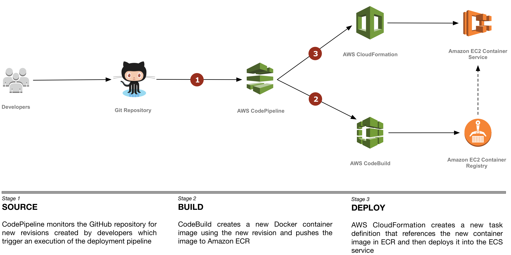

# ECS Reference Architecture: Continuous Deployment

The ECS Continuous Deployment reference architecture demonstrates how to achieve
[continuous deployment][continuous-deployment] of an application to Amazon
Elastic Container Service (Amazon ECS) using AWS CodePipeline and AWS
CodeBuild. With continuous deployment, software revisions are deployed to a
production environment automatically without explicit approval from a developer,
making the entire software release process automated.

Launching this AWS CloudFormation stack provisions a continuous deployment
process that uses AWS CodePipeline to monitor a GitHub repository for new
commits and AWS CodeBuild to create a new Docker container image and to push it
into Amazon Elastic Container Registry (Amazon ECR).

When creating this stack, you can opt to deploy the service onto [AWS
Fargate][fargate] or [Amazon EC2][ec2]. AWS Fargate allows you to run containers
without managing clusters or services. If you choose Amazon EC2, an Auto Scaling
group of t2.micro instances will be created to host your service.

[][architecture]

## Running the example

#### 1. Fork the GitHub repository

[Fork](https://help.github.com/articles/fork-a-repo/) the [Amazon ECS sample
app](https://github.com/awslabs/ecs-demo-php-simple-app) GitHub repository into
your GitHub account.

From your terminal application, execute the following command (make sure to
replace `<your_github_username>` with your actual GitHub username):

```console
git clone https://github.com/<your_github_username>/ecs-demo-php-simple-app
```

This creates a directory named `ecs-demo-php-simple-app` in your current
directory, which contains the code for the Amazon ECS sample app.

#### 2. Create the CloudFormation stack

Deploy | Region Name | Region | Launch Types
:---: | ------------ | ------------- | -------------
[🚀][us-east-1] | US East (N. Virginia) | us-east-1 | Fargate, EC2
[🚀][us-east-2] | US East (Ohio) | us-east-2 | EC2
[🚀][us-west-1] | US West (N. California) | us-west-1 | EC2
[🚀][us-west-2] | US West (Oregon) | us-west-2 | EC2
[🚀][eu-west-1] | EU (Ireland) | eu-west-1 | EC2
[🚀][eu-west-2] | EU (London) | eu-west-2 | EC2
[🚀][eu-central-1] | EU (Frankfurt) | eu-central-1 | EC2
[🚀][ap-southeast-1] | Asia Pacific (Singapore) | ap-southeast-1 | EC2
[🚀][ap-southeast-2] | Asia Pacific (Sydney) | ap-southeast-2 | EC2
[🚀][ap-northeast-1] | Asia Pacific (Tokyo) | ap-northeast-1 | EC2
[🚀][ap-northeast-2] | Asia Pacific (Seoul) | ap-northeast-2 | EC2
[🚀][ca-central-1] | Canada (Central) | ca-central-1 | EC2

This reference architecture can only be deployed to Regions which have all
necessary services available. See the [Region
Table](https://aws.amazon.com/about-aws/global-infrastructure/regional-product-services/)
for information about service availability.

The CloudFormation template requires the following parameters:

- Cluster Configuration
  - **Launch Type**: Deploy the service using either AWS Fargate or Amazon EC2.
    Selecting EC2 will create an Auto Scaling group of t2.micro instances for
    your cluster. See the [documentation][launch-types] to learn more about
    launch types.

- GitHub Configuration
  - **Repo**: The repo name of the sample service.
  - **Branch**: The branch of the repo to deploy continuously.
  - **User**: Your username on GitHub.
  - **Personal Access Token**: Token for the user specified above.
    ([https://github.com/settings/tokens](https://github.com/settings/tokens))

The CloudFormation stack provides the following output:

- **ServiceUrl**: The sample service that is being continuously deployed.
- **PipelineUrl**: The continuous deployment pipeline in the AWS Management
  Console.

### Testing the example

After the CloudFormation stack is created, the latest commit to the GitHub
repository is run through the pipeline and deployed to ECS. Open the
**PipelineUrl** to watch the first revision run through the CodePipeline
pipeline. After the deploy step turns green, open the URL from **ServiceUrl**
which loads a page similar to this:


To test continuous deployment, make a change to src/index.php in the
ecs-demo-php-simple-app repository and push it to GitHub. CodePipeline detects
the change, builds the new application, and deploys it to your cluster
automatically. After the pipeline finishes deploying the revision, reload the
page to see the changes made.

### Cleaning up the example resources

To remove all resources created by this example, do the following:

1. Delete the main CloudFormation stack which deletes the substacks and resources.
1. Manually delete resources which may contain content:

    - S3 Bucket: ArtifactBucket
    - ECR Repository: Repository

## CloudFormation template resources

The following sections explains all of the resources created by the
CloudFormation template provided with this example.

#### [DeploymentPipeline](templates/deployment-pipeline.yaml)

  Resources that compose the deployment pipeline include the CodeBuild project,
  the CodePipeline pipeline, an S3 bucket for deployment artifacts, and all
  necessary IAM roles used by those services.

#### [Service](templates/service.yaml)

  An ECS task definition, service, IAM role, and ECR repository for the sample
  application. This template is used by the CodePipeline pipeline to deploy the
  sample service continuously.

#### [Cluster](templates/ecs-cluster.yaml)

  An ECS cluster optionally backed by an Auto Scaling group of EC2 instances
  running the Amazon ECS-optimized AMI for the EC2 launch type.

#### [Load Balancer](templates/load-balancer.yaml)

  An Application Load Balancer to be used for traffic to the sample application.

#### [VPC](templates/vpc.yaml)

  A VPC with two public subnets on two separate Availability Zones, an internet
  gateway, and a route table with a default route to the public internet.

## License

This reference architecture sample is [licensed][license] under Apache 2.0.

[continuous-deployment]: https://aws.amazon.com/devops/continuous-delivery/
[architecture]: images/architecture.pdf
[license]: LICENSE
[fargate]: https://aws.amazon.com/fargate/
[ec2]: https://aws.amazon.com/ec2/
[launch-types]: https://docs.aws.amazon.com/AmazonECS/latest/developerguide/launch_types.html
[us-east-1]: https://console.aws.amazon.com/cloudformation/home?region=us-east-1#/stacks/create/review?stackName=ECS-ContinuousDeployment&templateURL=https://s3.amazonaws.com/ecs-refarch-continuous-deployment/ecs-refarch-continuous-deployment.yaml&param_LaunchType=Fargate
[us-east-2]: https://console.aws.amazon.com/cloudformation/home?region=us-east-2#/stacks/create/review?stackName=ECS-ContinuousDeployment&templateURL=https://s3.amazonaws.com/ecs-refarch-continuous-deployment/ecs-refarch-continuous-deployment.yaml&param_LaunchType=EC2
[us-west-1]: https://console.aws.amazon.com/cloudformation/home?region=us-west-1#/stacks/create/review?stackName=ECS-ContinuousDeployment&templateURL=https://s3.amazonaws.com/ecs-refarch-continuous-deployment/ecs-refarch-continuous-deployment.yaml&param_LaunchType=EC2
[us-west-2]: https://console.aws.amazon.com/cloudformation/home?region=us-west-2#/stacks/create/review?stackName=ECS-ContinuousDeployment&templateURL=https://s3.amazonaws.com/ecs-refarch-continuous-deployment/ecs-refarch-continuous-deployment.yaml&param_LaunchType=EC2
[eu-west-1]: https://console.aws.amazon.com/cloudformation/home?region=eu-west-1#/stacks/create/review?stackName=ECS-ContinuousDeployment&templateURL=https://s3.amazonaws.com/ecs-refarch-continuous-deployment/ecs-refarch-continuous-deployment.yaml&param_LaunchType=EC2
[eu-west-2]: https://console.aws.amazon.com/cloudformation/home?region=eu-west-2#/stacks/create/review?stackName=ECS-ContinuousDeployment&templateURL=https://s3.amazonaws.com/ecs-refarch-continuous-deployment/ecs-refarch-continuous-deployment.yaml&param_LaunchType=EC2
[eu-central-1]: https://console.aws.amazon.com/cloudformation/home?region=eu-central-1#/stacks/create/review?stackName=ECS-ContinuousDeployment&templateURL=https://s3.amazonaws.com/ecs-refarch-continuous-deployment/ecs-refarch-continuous-deployment.yaml&param_LaunchType=EC2
[ap-southeast-1]: https://console.aws.amazon.com/cloudformation/home?region=ap-southeast-1#/stacks/create/review?stackName=ECS-ContinuousDeployment&templateURL=https://s3.amazonaws.com/ecs-refarch-continuous-deployment/ecs-refarch-continuous-deployment.yaml&param_LaunchType=EC2
[ap-southeast-2]: https://console.aws.amazon.com/cloudformation/home?region=ap-southeast-2#/stacks/create/review?stackName=ECS-ContinuousDeployment&templateURL=https://s3.amazonaws.com/ecs-refarch-continuous-deployment/ecs-refarch-continuous-deployment.yaml&param_LaunchType=EC2
[ap-northeast-1]: https://console.aws.amazon.com/cloudformation/home?region=ap-northeast-1#/stacks/create/review?stackName=ECS-ContinuousDeployment&templateURL=https://s3.amazonaws.com/ecs-refarch-continuous-deployment/ecs-refarch-continuous-deployment.yaml&param_LaunchType=EC2
[ap-northeast-2]: https://console.aws.amazon.com/cloudformation/home?region=ap-northeast-2#/stacks/create/review?stackName=ECS-ContinuousDeployment&templateURL=https://s3.amazonaws.com/ecs-refarch-continuous-deployment/ecs-refarch-continuous-deployment.yaml&param_LaunchType=EC2
[ca-central-1]: https://console.aws.amazon.com/cloudformation/home?region=ca-central-1#/stacks/create/review?stackName=ECS-ContinuousDeployment&templateURL=https://s3.amazonaws.com/ecs-refarch-continuous-deployment/ecs-refarch-continuous-deployment.yaml&param_LaunchType=EC2
